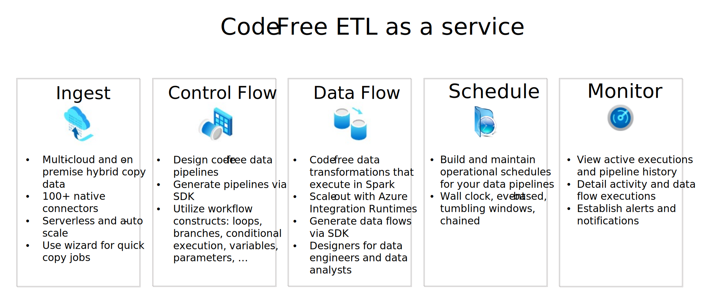
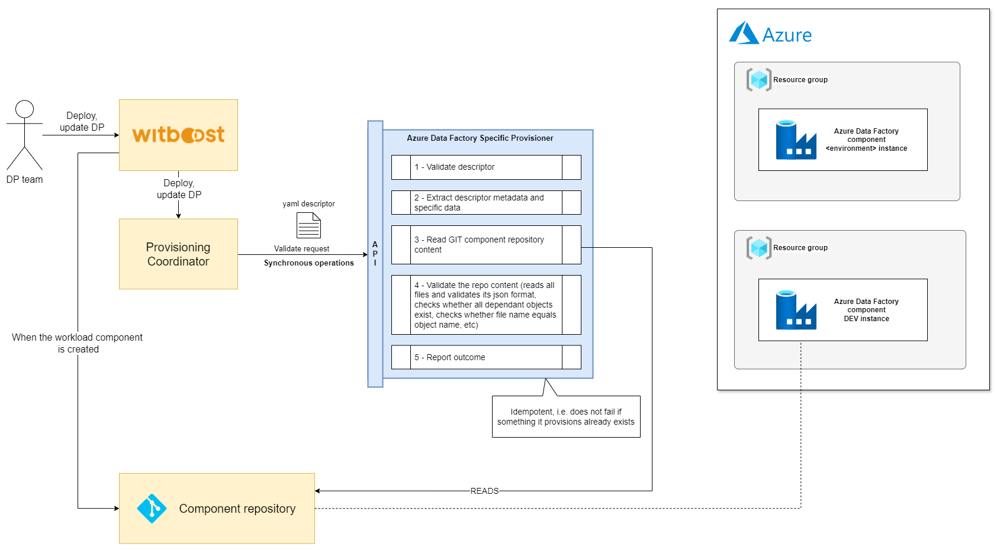
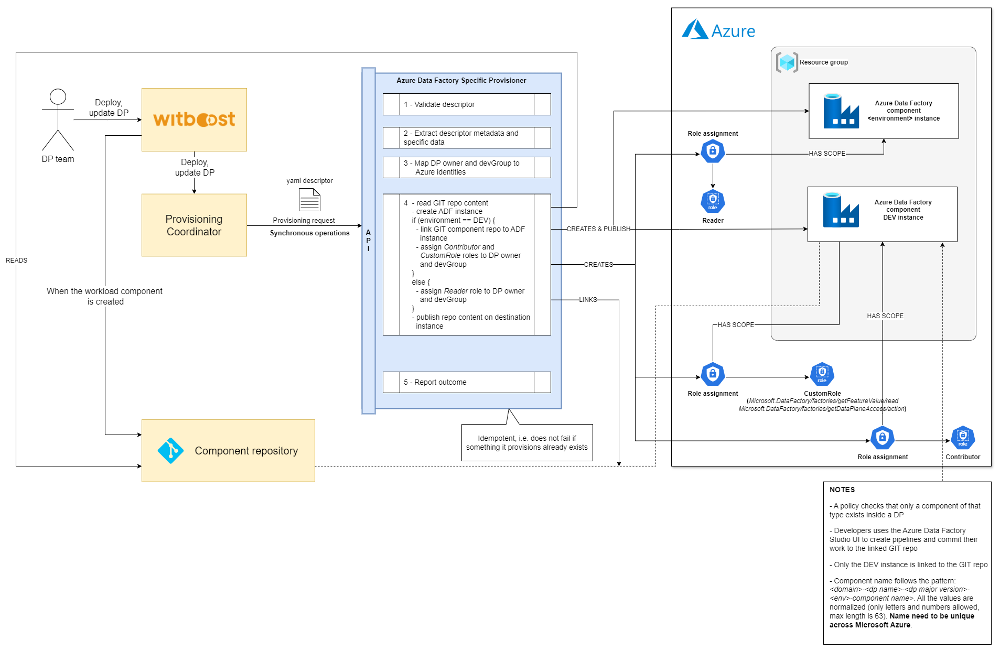
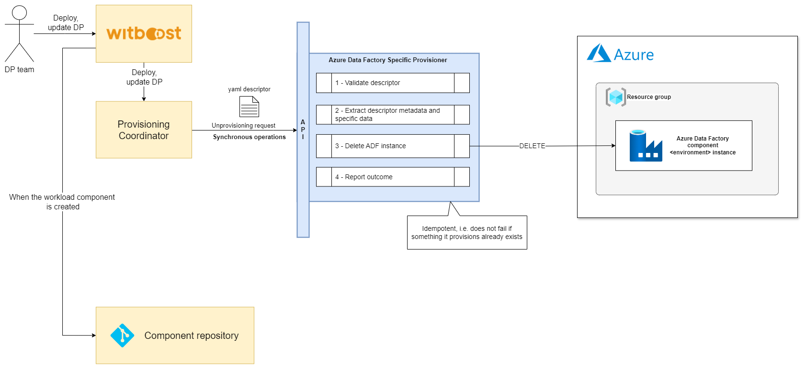

# High Level Design

This document describes the High Level Design of the Azure Data Factory Specific Provisioner.
The source diagrams can be found and edited in the [accompanying draw.io file](hld.drawio).

## Overview

### Specific Provisioner

A Specific Provisioner (SP) is a service in charge of performing a resource allocation task, usually
through a Cloud Provider. The resources to allocate are typically referred to as the _Component_, the
details of which are described in a YAML file, known as _Component Descriptor_.

The SP is invoked by an upstream service of the Witboost platform, namely the Coordinator, which is in charge of orchestrating the creation
of a complex infrastructure by coordinating several SPs in a single workflow. The SP receives
the _Data Product Descriptor_ as input with all the components (because it might need more context) plus the id of the component to provision, named _componentIdToProvision_

To enable the above orchestration a SP exposes an API made up of five main operations:
- validate: checks if the provided component descriptor is valid and reports any errors
- provision: allocates resources based on the previously validated descriptor; clients either receive an immediate response (synchronous) or a token to monitor the provisioning process (asynchronous)
- status: for asynchronous provisioning, provides the current status of a provisioning request using the provided token
- unprovision: destroys the resources previously allocated.
- updateacl: grants access to a specific component/resource to a list of users/groups

### Azure Data Factory

**Azure Data Factory** is Azure's cloud ETL service for scale-out serverless data integration and data transformation. It offers a code-free UI for intuitive authoring and single-pane-of-glass monitoring and management.

Data Factory contains a series of interconnected systems that provide a complete end-to-end platform for data engineers.

#### Concepts
Azure Data Factory is composed of the following key components:
- Pipelines
- Activities
- Datasets
- Linked services
- Data Flows
- Integration Runtimes

These components work together to provide the platform on which you can compose data-driven workflows with steps to move and transform data.

##### Pipeline
A data factory might have one or more pipelines. A pipeline is a logical grouping of activities that performs a unit of work. Together, the activities in a pipeline perform a task. For example, a pipeline can contain a group of activities that ingests data from an Azure blob, and then runs a Hive query on an HDInsight cluster to partition the data.

##### Mapping data flows
Create and manage graphs of data transformation logic that you can use to transform any-sized data. You can build-up a reusable library of data transformation routines and execute those processes in a scaled-out manner from your ADF pipelines. Data Factory will execute your logic on a Spark cluster that spins-up and spins-down when you need it. You won't ever have to manage or maintain clusters.

##### Activity
Activities represent a processing step in a pipeline. For example, you might use a copy activity to copy data from one data store to another data store. Similarly, you might use a Hive activity, which runs a Hive query on an Azure HDInsight cluster, to transform or analyze your data. Data Factory supports three types of activities: data movement activities, data transformation activities, and control activities.

##### Datasets
Datasets represent data structures within the data stores, which simply point to or reference the data you want to use in your activities as inputs or outputs.

##### Linked services
Linked services are much like connection strings, which define the connection information that's needed for Data Factory to connect to external resources.

##### Integration Runtime
In Data Factory, an integration runtime provides the bridge between the activity and linked Services. It's referenced by the linked service or activity, and provides the compute environment where the activity either runs on or gets dispatched from.

##### Triggers
Triggers represent the unit of processing that determines when a pipeline execution needs to be kicked off. There are different types of triggers for different types of events.

### Azure Data Factory Specific Provisioner

The Specific Provisioner interact with Azure through the **Azure SDK for Java**.

Every Data Product can have only an instance of this Component (enforced through a Witboost policy). This is required since a single Azure Data Factory instance can be connected to a single GIT repository that will be the component repository automatically provisioned by Witboost.

The development team interacts with the Data Factory using the UI, visually authoring resources and pipelines. **This interaction is only allowed for the development environment**. The changes made by the team are stored on the connected GIT repository.

To publish the resources, the standard Witboost Deployment process is used: the resources are then promoted to the specific environment starting from the GIT repository content.

## Validation

1. **Process Initiation:** The provisioner receives a provisioning request containing a YAML descriptor from the Provisioning Coordinator. This marks the beginning of the validation process.
2. **Descriptor Analysis:** In the initial phase, the descriptor is analyzed for correctness. This includes checking the syntax and the validity of the specific section.
3. **Component repository Verification:** Following the descriptor analysis, the process involves validating the repository content:
    - reads all files and validates its json format
    - checks whether all dependant objects exist
    - checks whether file name equals object name
4. **Outcome:** Upon finishing the verification, the provisioner returns a `ValidationResult` and proceeds with the next steps in the execution process. In case of any discrepancies or errors found during the validation process, appropriate error messages are communicated back to the requester.

## Provisioning

1. **Process Initiation:** A provisioning request, containing a YAML descriptor, is sent to the provisioner from the Provisioning Coordinator.
2. **Request Validation:** Upon receiving the request, the provisioner validates it to ensure compliance with required criteria. This validation is crucial for confirming that the processed requests are appropriate and authorized.
3. **Metadata and specific data extraction:** The provisioner extract all the required metadata and data from the request.
4. **Principal mapping:** `Data Product Owner` and `development group` are mapped to the respective `Azure identities`.
5. **Provision handling:**
    * Read component GIT repository
    * Data Factory instance creation
    * If we are deploying in the development environment:
      * Link ADF instance to the GIT component repository
      * Role assignments to `Data Product Owner` and `development group`:
        - `Contributor` role at the data factory level
        - `Custom role` with permissions for the actions `Microsoft.DataFactory/factories/getFeatureValue/read` and `Microsoft.DataFactory/factories/getDataPlaneAccess/action` at the data factory level (this is required to test a connection in a linked service or to preview data in a dataset)
   * If we are NOT deploying in the development environment:
       * Role assignment to `Data Product Owner` and `development group`:
           - `Reader` role at the data factory level
   * Publish on Data Factory instance
6. **Provisioning Status Feedback:** The provisioner returns a `ProvisioningStatus`. This status confirms the successful deployment of the resources on the target Data Factory instance and contains a link to open the resource on Azure Portal

## Unprovisioning

1. **Process Initiation:** The provisioner receives a provisioning request containing a YAML descriptor from the Provisioning Coordinator.
2. **Request Validation:** The provisioner validates the request by following the predefined steps. This validation ensures that the request meets the necessary criteria and is authorized for processing.
3. **Metadata and specific data extraction:** The provisioner extract all the required metadata and data from the request to build the request to be sent.
4. **Unprovision Handling:** After validation, the provisioner proceeds to delete the Data Factory instance
5. **Results:** Following the completion of these actions, the provisioner returns a `ProvisioningStatus`. This status serves as confirmation of the request's processing.

